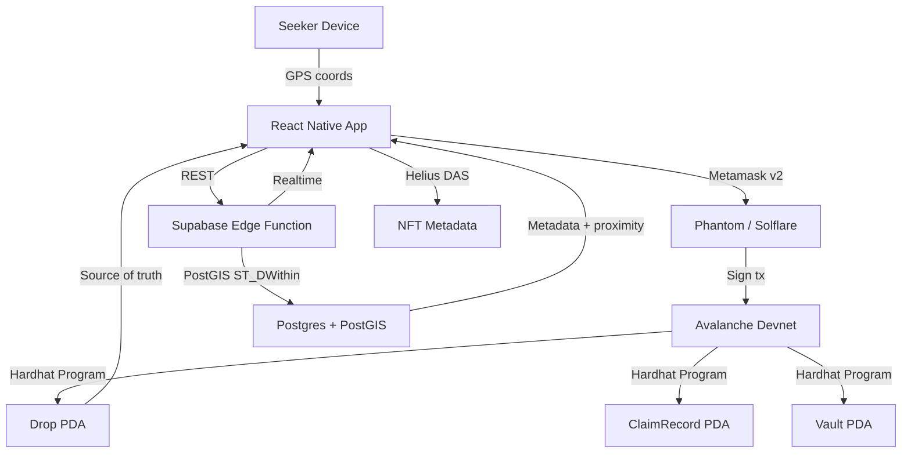

<div align="center">

# 🎯 LootDrop

**GPS-based on-chain asset scavenger hunt for the Avalanche Mobile Seeker**

[](https://avalanche.com)
[](https://expo.dev)
[](https://www.anchor-lang.com)
[](https://www.typescriptlang.org)
[](https://supabase.com)

*Go outside. Claim real crypto. Own it forever.*

**📲 [Download Deployed APK (EAS Build)](https://github.com/LootDropX/Android/blob/main/android/app/build/outputs/apk/release/app-release.apk)**


</div>

---

## Table of Contents

1. [Overview](#overview)
2. [Core Game Loop](#core-game-loop)
3. [Architecture](#architecture)
4. [Tech Stack](#tech-stack)
5. [Rarity System](#rarity-system)
6. [Folder Structure](#folder-structure)
7. [Prerequisites](#prerequisites)
8. [Environment Variables](#environment-variables)
9. [Getting Started](#getting-started)
   - [1. Install Dependencies](#1-install-dependencies)
   - [2. Configure Environment](#2-configure-environment)
   - [3. Set Up Supabase](#3-set-up-supabase)
   - [4. Build & Deploy the Hardhat Program](#4-build--deploy-the-anchor-program)
   - [5. Run the Mobile App](#5-run-the-mobile-app)
10. [App Screens](#app-screens)
11. [Developer Mode](#developer-mode)
12. [Hooks Reference](#hooks-reference)
13. [On-Chain Program](#on-chain-program)
14. [Supabase Edge Functions](#supabase-edge-functions)
15. [Scripts](#scripts)
16. [Contributing](#contributing)
17. [License](#license)

---

## Overview

LootDrop is a **GPS-gated, on-chain asset distribution protocol** wrapped in a mobile scavenger hunt game. Creators pin digital loot — AVAX, SPL tokens, or NFTs — to real-world coordinates. Players physically walk to those locations, tap **Claim**, sign a transaction in their wallet, and the asset lands on-chain in their wallet.

All asset custody and claim logic lives in a trustless **Solidity contract** on Avalanche. Supabase handles metadata, geospatial proximity queries (via PostGIS), and the leaderboard. The app targets Android & IOS users.

Key properties:
- **Trustless** — the Solidity contract enforces all rules; the client cannot lie about proximity
- **Permissionless** — anyone with a Devnet wallet can claim or create drops
- **Non-custodial** — AVAX rewards are escrowed in a vault PDA and released atomically on claim
- **Composable** — drops support AVAX, any SPL token, and cNFTs/NFTs via Metaplex

---

## Core Game Loop

```
Open app → GPS map loads, drop markers pulse on screen
      ↓
Walk toward nearest glowing marker
      ↓
Enter claim zone → CLAIM button activates
      ↓
Tap CLAIM → Hardhat instruction builds → Metamask prompts wallet signature
      ↓
Transaction confirms on Avalanche → AVAX / NFT / token lands in wallet
      ↓
Inventory updates · Leaderboard climbs · Haptic celebration fires
```

---

## Architecture



**Data flow for a claim:**

1. App calls the `nearby-drops` Edge Function → PostGIS returns drops sorted by distance
2. Client validates GPS proximity locally (pre-flight check)
3. Client builds a `claim_drop` Hardhat instruction with `distance_cm`
4. Metamask presents the transaction to the user's wallet for signing
5. Signed transaction is submitted to the RPC node
6. On-chain program verifies the drop is active, not expired, not full, and the claimer hasn't claimed it before
7. Vault PDA releases AVAX to the claimer (AVAX drops) or signals token transfer
8. Client writes a `claims` record to Supabase (non-fatal if it fails — chain is source of truth)
9. TanStack Query caches are invalidated → UI updates

---

## Tech Stack

| Layer | Technology |
|---|---|
| **Mobile framework** | React Native 0.74 · Expo SDK 51 (bare workflow) |
| **Language** | TypeScript 5 (strict mode) |
| **Navigation** | Expo Router v3 · React Navigation v6 |
| **Avalanche SDK** | `@avalanche/web3.js` v1.x |
| **Wallet** | Avalanche Mobile Wallet Adapter (Metamask) v2 |
| **On-chain program** | Hardhat framework (Rust) |
| **NFT metadata** | Metaplex Umi + `mpl-token-metadata` |
| **Maps** | Geoapify tiles via WebView (Leaflet) |
| **Location** | Expo Location API |
| **Styling** | NativeWind v4 (Tailwind CSS for React Native) |
| **Global state** | Zustand v4 |
| **Server state** | TanStack Query v5 |
| **Backend** | Supabase (Postgres + PostGIS + Edge Functions + Realtime) |
| **Geospatial index** | Geohash precision-7 + PostGIS GIST index |
| **Feedback** | Expo Haptics · React Native Reanimated v3 |

---

## Rarity System

LootDrop has four rarity tiers. Higher rarity means larger rewards, wider claim zones, faster pulse animations, and lower spawn probability.

| Tier | Color | Claim Radius | AVAX Range | Spawn Weight | Pulse Speed |
|---|---|---|---|---|---|
| 🩶 **Common** | `#6B7280` | 50 m | 0.001 – 0.01 AVAX | 60% | 2000 ms |
| 💙 **Rare** | `#3B82F6` | 75 m | 0.01 – 0.1 AVAX | 25% | 1500 ms |
| 💜 **Epic** | `#8B5CF6` | 100 m | 0.1 – 0.5 AVAX | 12% | 1000 ms |
| 🟡 **Legendary** | `#F59E0B` | 150 m | 0.5 – 2.0 AVAX | 3% | 800 ms |

---

## Folder Structure

```
Loot-Drop/
├── app/                        # Expo Router screens
│   ├── (auth)/                 # Auth/connect flow
│   ├── (tabs)/                 # Bottom-tab screens
│   │   ├── map.tsx             # 🗺  Hero screen — live GPS map
│   │   ├── inventory.tsx       # 🎒  Claimed loot grid
│   │   └── profile.tsx         # 👤  Wallet, leaderboard, dev mode
│   ├── drop/                   # Drop detail routes
│   ├── _layout.tsx             # Root layout (providers)
│   └── index.tsx               # Entry redirect
│
├── src/
│   ├── components/             # Pure UI components
│   │   ├── drops/              # DropCard, DropDetailSheet, RarityBadge
│   │   ├── map/                # GeoapifyMap, ClaimZoneIndicator
│   │   ├── ui/                 # Button, LoadingPulse, ErrorBoundary
│   │   └── wallet/             # ConnectButton, WalletGuard
│   ├── hooks/                  # All business logic
│   │   ├── useClaimDrop.ts     # ★ Critical — full claim orchestration
│   │   ├── useCreateDrop.ts    # Drop creation flow
│   │   ├── useDropProximity.ts # Real-time distance to a single drop
│   │   ├── useInventory.ts     # User's claimed loot
│   │   ├── useLeaderboard.ts   # Global rankings
│   │   ├── useLocation.ts      # GPS + permission management
│   │   ├── useNearbyDrops.ts   # Polling nearby drops
│   │   └── useWallet.ts        # Metamask connect/disconnect
│   ├── program/                # Hardhat client bindings
│   │   ├── accounts/           # Drop.ts, ClaimRecord.ts deserializers
│   │   ├── instructions/       # claimDrop.ts, createDrop.ts, expireDrop.ts
│   │   └── lootdrop.ts         # IDL + program client
│   ├── services/               # External service adapters
│   │   ├── drops.service.ts    # Supabase drop/claim CRUD
│   │   ├── geohash.service.ts  # Geohash encode/decode
│   │   ├── nft.service.ts      # Helius DAS NFT fetching
│   │   └── supabase.ts         # Supabase client singleton
│   ├── stores/                 # Zustand global state
│   │   ├── location.store.ts   # GPS coordinates
│   │   ├── map.store.ts        # Selected drop, dev mode
│   │   └── wallet.store.ts     # Public key, auth token
│   ├── types/                  # TypeScript interfaces
│   │   ├── drop.types.ts       # Drop, NearbyDrop, ClaimRecord, etc.
│   │   ├── nft.types.ts        # InventoryItem, NFT metadata
│   │   └── supabase.types.ts   # Generated DB row types
│   ├── constants/              # Config values
│   │   ├── demoDrop.ts         # Union Square, SF demo coords
│   │   ├── map.ts              # Poll interval, search radius
│   │   ├── rarity.ts           # Radii, colors, AVAX ranges, animations
│   │   └── avalanche.ts           # RPC URL, program ID, Metamask identity
│   └── utils/                  # Pure utility functions
│       ├── distance.ts         # Haversine formula
│       ├── format.ts           # AVAX formatting, public key truncation
│       └── geofence.ts         # Point-in-radius helpers
│
│
├── supabase/
│   ├── migrations/
│   │   └── 001_initial.sql     # drops + claims tables, PostGIS, RLS
│   └── functions/
│       └── nearby-drops/       # Edge Function — PostGIS proximity query
│           └── index.ts
│
│
├── app.config.ts               # Expo config (env var injection)
├── babel.config.js
├── tailwind.config.js
├── tsconfig.json
└── .env.example                # Template for all required env vars
```

---

## Prerequisites

| Tool | Version | Notes |
|---|---|---|
| Node.js | ≥ 20 LTS | |
| npm | ≥ 10 | bundled with Node 20 |
| Expo CLI | latest | `npm i -g expo-cli` |
| Rust | stable | `curl https://sh.rustup.rs -sSf | sh` |
| Avalanche CLI | ≥ 1.18 | [Install guide](https://docs.avalanche.com/cli/install-avalanche-cli-tools) |
| Hardhat CLI | ≥ 0.30 | `cargo install --git https://github.com/coral-xyz/anchor avm --locked && avm install latest` |
| Supabase CLI | latest | `npm i -g supabase` |
| Android SDK | API 33+ | Required for Seeker device / emulator |
| Map tiles | — | Uses Geoapify tile API |


---

## Environment Variables

Copy `.env.example` to `.env` and fill in each value:

```bash
cp .env.example .env
```

| Variable | Description | Required |
|---|---|---|
| `EXPO_PUBLIC_AVAXANA_RPC_URL` | Avalanche RPC endpoint (Helius, QuickNode, etc.) | ✅ |
| `EXPO_PUBLIC_PROGRAM_ID` | Deployed Solidity contract ID (base58) | ✅ |
| `EXPO_PUBLIC_SUPABASE_URL` | Supabase project URL | ✅ |
| `EXPO_PUBLIC_SUPABASE_ANON_KEY` | Supabase anon/public key (safe to expose) | ✅ |
| `EXPO_PUBLIC_HELIUS_API_KEY` | Helius API key for DAS NFT queries | ✅ |
| `AVAXANA_CLUSTER` | `fuji` or `mainnet` | ✅ |
| `SUPABASE_SERVICE_ROLE_KEY` | **Server-side only** — used in Edge Functions and seed script | ⚠️ Never expose to client |

> All `EXPO_PUBLIC_*` variables are injected into the app bundle at build time via `app.config.ts`. The `SUPABASE_SERVICE_ROLE_KEY` is strictly server-side and must never be committed or bundled.

---

## Getting Started

### 1. Install Dependencies

```bash
git clone https://github.com/UncleTom29/Loot-Drop.git
cd Loot-Drop
npm install
```

### 2. Configure Environment

```bash
cp .env.example .env
# Edit .env with your actual values
```

### 3. Set Up Supabase

**Option A — Supabase Cloud (recommended)**

1. Create a new project at [supabase.com](https://supabase.com)
2. Run the initial migration:

```bash
supabase db push --db-url "postgresql://postgres:<password>@db.<project-ref>.supabase.co:5432/postgres"
# or via the Supabase Dashboard → SQL Editor, paste supabase/migrations/001_initial.sql
```

3. Deploy the Edge Function:

```bash
supabase functions deploy nearby-drops --project-ref <your-project-ref>
```

4. Copy your project URL and anon key into `.env`.

**Option B — Local Supabase**

```bash
supabase start          # starts local Postgres + PostGIS + Edge Functions
supabase db reset       # applies migrations/001_initial.sql
supabase functions serve nearby-drops
```

Update `EXPO_PUBLIC_SUPABASE_URL` to `http://127.0.0.1:54321` and `EXPO_PUBLIC_SUPABASE_ANON_KEY` to the local anon key printed by `supabase start`.

### 4. Build & Deploy the Hardhat Program

```bash
cd program

# Install Rust dependencies
cargo build-bpf

# Build the program
anchor build

# Configure Avalanche CLI to use Devnet
avalanche config set --url devnet

# Airdrop AVAX for deployment fees
avalanche airdrop 2

# Deploy
anchor deploy

# Copy the program ID printed by `anchor deploy` into:
#   - .env            → EXPO_PUBLIC_PROGRAM_ID
#   - Hardhat.toml     → [programs.devnet] lootdrop = "<ID>"
#   - program/programs/lootdrop/src/lib.rs → declare_id!("<ID>")

cd ..
```-seeded demo drops on Devnet, you can skip the Hardhat deployment and use the placeholder program ID from `.env.example`.

### 5. Run the Mobile App

**Development build (recommended — required for Metamask)**

```bash
# Android (device or emulator)
npm run android
```

> Metamask requires a real device or an emulator with Google Play Services. The Expo Go app does **not** support Metamask.

**Start Metro for the installed development build**

```bash
npm start
```

**Start Metro and immediately open Android dev client**

```bash
npm run start:android
```

> Do not use Expo Go for this project. If the CLI tries to open `host.exp.exponent`, build/install the native app first with `npm run android`, then reconnect with `npm start` or `npm run start:android`.

**Type-check**

```bash
npm run typecheck
```

**Lint**

```bash
npm run lint
```

**Tests**

```bash
npm test
```

---

## App Screens

### 🗺 Map (`app/(tabs)/map.tsx`)

The hero screen. A fullscreen dark Geoapify map renders drop markers colour-coded by rarity. When the user taps a marker, a bottom sheet appears showing drop details, rarity badge, asset amount, claim count, and — if within range — an active **Claim** button.

- Polls `nearby-drops` every 30 seconds
- Refetches automatically when the app returns to the foreground
- Shows a `{n} drops nearby` badge at the bottom
- Requests `ACCESS_FINE_LOCATION` on first launch

### 🎒 Inventory (`app/(tabs)/inventory.tsx`)

A 2-column grid of all drops the connected wallet has claimed. Displays:

- Total claims count
- Total AVAX earned
- NFT cards with rarity badge
- Pull-to-refresh

### 👤 Profile (`app/(tabs)/profile.tsx`)

- Wallet address (truncated) + disconnect button
- Top-10 global leaderboard (ranked by total claims)
- User's current rank
- **Developer Mode** toggle (Devnet builds only) — see below

---

## Developer Mode

Developer Mode overrides GPS coordinates to the demo coordinates defined in `src/constants/demoDrop.ts` (`37.77490, -122.41942`), allowing judges and developers to test the full claim flow without physically traveling.

**Enabling Developer Mode:**

1. Open the **Profile** tab
2. Toggle **Enable Dev Mode** (visible on Devnet builds only)
3. A yellow banner appears: `⚠️ DEV MODE — GPS OVERRIDDEN`
4. The map now shows you at Union Square — the **Genesis Relic** Legendary drop is within range
5. Tap the marker → tap **Claim** → sign in your wallet → loot acquired

Dev Mode is enforced at the store layer (`map.store.ts`). Both `useClaimDrop` and `useNearbyDrops` read from the same dev coordinates, ensuring consistent behaviour throughout the app.

---

## Seeding Devnet Drops

The `scripts/seed-devnet-drops.ts` script inserts 15 demo drops into Supabase (Devnet Avalanche transactions are simulated with placeholder on-chain addresses for speed):

| Count | Rarity | AVAX Range | Location |
|---|---|---|---|
| 8 | Common | 0.002 – 0.009 AVAX | Random within SF bounding box |
| 4 | Rare | 0.04 – 0.09 AVAX | Random within SF bounding box |
| 2 | Epic | 0.25 – 0.40 AVAX | Random within SF bounding box |
| 1 | Legendary | 1.0 AVAX | Union Square, SF (`37.7879, -122.4075`) |

**Run the seed script:**

```bash
EXPO_PUBLIC_SUPABASE_URL=https://your-project.supabase.co \
SUPABASE_SERVICE_ROLE_KEY=your-service-role-key \
EXPO_PUBLIC_AVAXANA_RPC_URL=https://api.devnet.avalanche.com \
EXPO_PUBLIC_PROGRAM_ID=LootXXXXXXXXXXXXXXXXXXXXXXXXXXXXXXXXXXXXXX \
npx ts-node scripts/seed-devnet-drops.ts
```

---

## Hooks Reference

All business logic lives in `src/hooks/`. Components are pure UI.

| Hook | Description |
|---|---|
| `useClaimDrop()` | Orchestrates the full claim sequence: GPS validation → build Hardhat instruction → Metamask sign → submit → confirm → write to Supabase → haptic feedback. Returns `{ claim, claimState, error, lastTxSignature }`. |
| `useCreateDrop()` | Full drop creation flow: build `create_drop` instruction → Metamask sign → confirm → write metadata to Supabase. Returns `{ createDrop, createState, error }`. |
| `useNearbyDrops()` | Polls the `nearby-drops` Edge Function every 30 seconds. Maps raw Supabase rows to `NearbyDrop` with `isClaimable` and `distanceMeters`. Returns `{ drops, isLoading, error, refetch }`. |
| `useDropProximity(drop)` | Calculates real-time distance to a single drop and whether the user is within the claim radius. |
| `useInventory()` | Fetches the connected wallet's claim history and NFT metadata via Helius DAS. Returns `{ nfts, solEarned, totalClaims, isLoading, refetch }`. |
| `useLeaderboard()` | Fetches global rankings from Supabase ordered by `totalClaims`. Returns `{ entries, isLoading }`. |
| `useLocation()` | Manages Expo Location permissions and streams GPS coordinates into `location.store`. Returns `{ coords, permissionStatus, error }`. |
| `useWallet()` | Wraps Metamask `transact` for connect/disconnect. Persists `publicKey` and `authToken` in `wallet.store`. Returns `{ publicKey, connect, disconnect, isConnecting }`. |

### Claim State Machine

`useClaimDrop` exposes a `claimState` field that progresses through:

```
idle → validating → building_tx → awaiting_signature → confirming → success
                                                                   ↘ error
```

### Claim Error Codes

| Code | Meaning |
|---|---|
| `OUT_OF_RANGE` | User is outside the claim radius; includes `distanceMeters` and `requiredMeters` |
| `DROP_INACTIVE` | Drop has been deactivated on-chain |
| `DROP_EXPIRED` | Drop's `expiresAt` timestamp has passed |
| `DROP_FULL` | `currentClaims >= maxClaims` |
| `ALREADY_CLAIMED` | This wallet has claimed this drop before |
| `WALLET_NOT_CONNECTED` | No Metamask session active |
| `USER_REJECTED` | User cancelled in their wallet |
| `TX_EXPIRED` | Transaction confirmation timed out (30 s) |
| `RPC_ERROR` | Avalanche RPC returned an error |
| `UNKNOWN` | Catch-all with raw message |

---

### Error Codes

| Error | Message |
|---|---|
| `DropExpired` | The drop has expired |
| `DropFullyClaimed` | All claims have been taken |
| `AlreadyClaimed` | You have already claimed this drop |
| `DropInactive` | This drop is no longer active |
| `InvalidCoordinates` | Invalid coordinate values |
| `TitleTooLong` | Title exceeds 50 characters |
| `DescriptionTooLong` | Description exceeds 200 characters |
| `InvalidAmount` | Asset amount must be greater than zero |
| `InvalidMaxClaims` | Max claims must be greater than zero |


---

## Supabase Edge Functions

### `nearby-drops` (`supabase/functions/nearby-drops/index.ts`)

A Deno edge function that performs a PostGIS proximity query.

**Request body:**

```json
{
  "latitude": 37.7749,
  "longitude": -122.4194,
  "radius_meters": 2000,
  "wallet_address": "optional-base58-public-key"
}
```

**Response:**

```json
{
  "drops": [
    {
      "id": "uuid",
      "title": "Genesis Relic",
      "distance_meters": 142.3,
      "already_claimed": false,
      ...
    }
  ]
}
```

**Database schema highlights (`supabase/migrations/001_initial.sql`):**

```sql
-- Spatial index enables sub-10ms proximity queries at scale
CREATE INDEX idx_drops_location ON drops USING GIST(location);

-- Compound index for active/expiry filtering
CREATE INDEX idx_drops_active_expiry ON drops (is_active, expires_at);

-- Geohash index for O(1) cell lookups
CREATE INDEX idx_drops_geohash ON drops (geohash);
```

Row Level Security is enabled on both `drops` and `claims`. Public reads are allowed; inserts require the `service_role` key (backend only).

---

## Scripts

| Script | Command | Description |
|---|---|---|
| Start Metro | `npm start` | Launch Expo dev server in dev-client mode |
| Start Android Dev Client | `npm run start:android` | Launch dev server and open the installed Android build |
| Run Android | `npm run android` | Build & launch on Android |
| Run iOS | `npm run ios` | Build & launch on iOS (secondary) |
| Lint | `npm run lint` | ESLint over `.ts` and `.tsx` |
| Type-check | `npm run typecheck` | `tsc --noEmit` |
| Test | `npm test` | Jest (jest-expo preset) |

---

## Contributing

1. Fork the repository and create a feature branch: `git checkout -b feat/my-feature`
2. Follow the architecture rules in `.github/copilot-instructions.md`:
   - Every component is a typed functional component with an explicit props interface
   - Custom hooks handle **all** business logic — components are pure UI
   - JSDoc on every exported function and hook
   - Secrets via `expo-constants` / environment variables only
3. Run `npm run typecheck && npm run lint && npm test` before opening a PR
4. Open a pull request against `main`

---

## License

This project was built for the **Avalanche Mobile Hackathon**. See [LICENSE](LICENSE) for details.

---

<div align="center">

Built with ❤️ for the Avalanche Mobile Seeker · [GitHub](https://github.com/UncleTom29/Loot-Drop)

</div>
